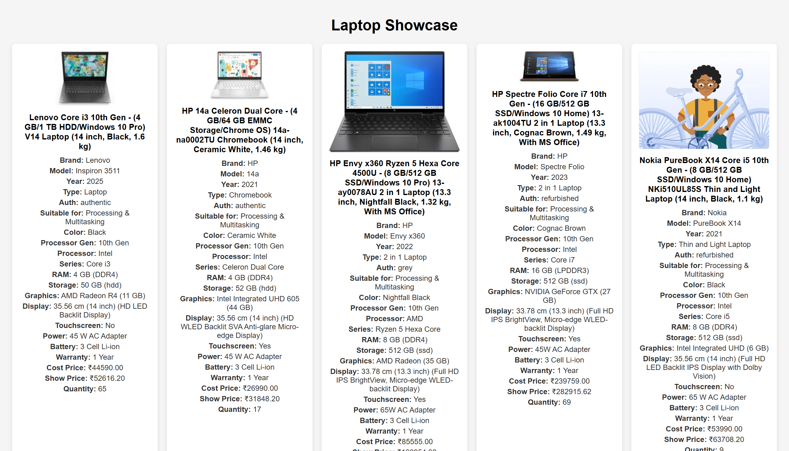
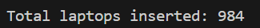

# Laptop Scraper + Flask Showcase App

This is a Python-based scraper and web app project. It does the following:

- Reads a laptop dataset from Kaggle (CSV format)
- Cleans and enriches data (e.g., RAM, processor info)
- Scrapes images from Flipkart product URLs
- Stores the laptop data + image URLs into a PostgreSQL database
- Launches a Flask web app that displays the scraped data

## 📦 Setup

### 1. Clone this repo

```bash
git clone https://github.com/fedupGenJi/python-Scrapper.git
cd python-Scrapper
```

### 2. Set up `.env`

Create a `.env` file with your PostgreSQL connection string:

```
DATABASE_URL=postgresql+psycopg2://<username>:<password>@localhost:5432/<dbname>
```

### 3. Install dependencies

```bash
pip install -r requirements.txt
```

---

## 🛠 Usage

### Step 1: Create database tables

```bash
python demo.py
```

### Step 2: Run scraper + insert into database

```bash
python databasepy.py
```

This will:
- Read rows from the Kaggle dataset
- Clean/normalize fields
- Scrape image URLs from Flipkart links
- Insert into `laptop_details` and `laptop_side_images` tables

### Step 3: Start the Flask server

```bash
cd flaskCore
python app.py
```

Then visit:

```
http://127.0.0.1:5000/
```

You’ll see a beautiful gallery of laptops with the scraped data and images.

---

## 🧪 Optional Utilities

- `nullCheck.py`: Print rows that have `NULL` values
- You can extend the app to include filtering, sorting, or admin upload

---

## 📸 Screenshots

__
__

---
